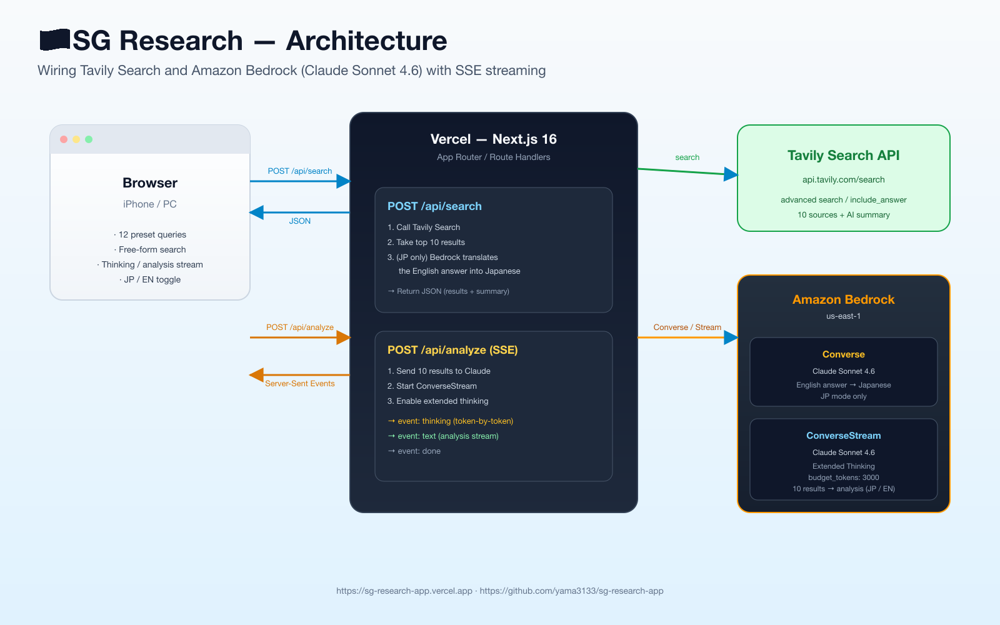

> I built this because I got tired of typing the same Singapore-trip questions into ChatGPT every few days. But it doubles as a minimal sample for anyone who wants to try **piping Tavily search results into Bedrock's Claude and streaming the model's extended thinking back via SSE** — which is the part of this post that probably matters more to other people.

- **Live**: https://sg-research-app.vercel.app
- **Code (public)**: https://github.com/yama3133/sg-research-app
- **Stack**: Next.js 16 (App Router) / Tavily Search API / Amazon Bedrock (Claude Sonnet 4.6) / Vercel



## Why I built it

Trip-prep questions tend to repeat: weather, flights, SIMs, Grab vs taxi, where to stay, what to eat. Rather than re-asking ChatGPT, I wanted a single page where I tap a preset and get:

1. The top web results (with clickable sources)
2. A Japanese summary of those results
3. An AI analysis that **reads all 10 sources** and produces a structured take

…and as a bonus, a way to **show Bedrock's extended thinking live** in the UI. That last part is the experiment.

## High-level flow

One user click triggers a two-step pipeline:

1. **`POST /api/search`** — call Tavily. In JP mode, also translate Tavily's English `answer` into Japanese via Bedrock's `Converse`.
2. **`POST /api/analyze`** — hand the 10 results to Claude. Use **`ConverseStream` + extended thinking** to push both the "Thinking" tokens and the final analysis to the browser as Server-Sent Events. The client reads `response.body` with `getReader()` and incrementally renders both blocks.

> Tavily already returns an AI summary when you pass `include_answer: "advanced"`. That alone is usable. But to **synthesize across the 10 sources for *your* query**, an LLM pass on top is what makes the UX feel "smart" rather than "linked".

## Core 1: Call Tavily, then translate

```ts
// app/api/search/route.ts
const payload = {
  query,
  search_depth: "advanced",
  include_answer: "advanced",
  max_results: 10,
  topic: "general",
};

const upstream = await fetch("https://api.tavily.com/search", {
  method: "POST",
  headers: {
    "Content-Type": "application/json",
    Authorization: `Bearer ${apiKey}`,
  },
  body: JSON.stringify(payload),
  cache: "no-store",
});
```

If the user is in JP mode, run the English `answer` through Bedrock's `Converse` for a Japanese summary:

```ts
const client = new BedrockRuntimeClient({ region: "us-east-1" });
const res = await client.send(new ConverseCommand({
  modelId: "us.anthropic.claude-sonnet-4-6",
  system: [{ text: "Translate the English summary into a natural, concise Japanese summary..." }],
  messages: [{ role: "user", content: [{ text: `${query}\n\n${englishAnswer}` }] }],
  inferenceConfig: { maxTokens: 1200, temperature: 0.2 },
}));
```

One-shot — concatenate `output.message.content[].text` and return as `answer_ja`.

**Tip**: the translation adds ~5 seconds per search. In EN mode I skip it (`body.lang !== "en"`) so the search feels snappy.

## Core 2: Stream extended thinking over SSE

This is the part I actually wanted to play with. Pass `additionalModelRequestFields.thinking` to `ConverseStreamCommand` to turn it on:

```ts
const command = new ConverseStreamCommand({
  modelId: "us.anthropic.claude-sonnet-4-6",
  system: [{ text: "...research assistant for Singapore business travel..." }],
  messages: [{ role: "user", content: [{ text: userPrompt }] }],
  inferenceConfig: { maxTokens: 6000, temperature: 1 },
  additionalModelRequestFields: {
    thinking: { type: "enabled", budget_tokens: 3000 },
  },
});

const response = await client.send(command);
```

Then iterate the response stream and split blocks by type:

```ts
for await (const event of response.stream) {
  if (event.contentBlockDelta?.delta) {
    const delta = event.contentBlockDelta.delta;
    if ("reasoningContent" in delta && delta.reasoningContent?.text) {
      send("thinking", { text: delta.reasoningContent.text });  // ← the model thinking
    } else if ("text" in delta && delta.text) {
      send("text", { text: delta.text });                        // ← the user-facing answer
    }
  }
}
```

`reasoningContent.text` is **what Claude is reasoning about**, `text` is **the final answer**. I push them to the browser as two different SSE event names.

Client-side it's standard SSE parsing:

```ts
const reader = res.body.getReader();
const decoder = new TextDecoder();
let buffer = "";
while (true) {
  const { value, done } = await reader.read();
  if (done) break;
  buffer += decoder.decode(value, { stream: true });
  const events = buffer.split("\n\n");
  buffer = events.pop() ?? "";
  for (const ev of events) {
    // dispatch event:thinking / event:text, append payload.text to state
  }
}
```

That gives you two live-updating blocks: 💭 **Thinking** (the model's reasoning, in a collapsible) and 📝 **Analysis** (the final structured answer).

## Core 3: SSE from a Next.js 16 Route Handler

Next.js 16 Route Handlers are Web-standard `Request` / `Response`, so returning a `ReadableStream` is enough:

```ts
const encoder = new TextEncoder();
const stream = new ReadableStream({
  async start(controller) {
    const send = (event: string, data: unknown) =>
      controller.enqueue(encoder.encode(`event: ${event}\ndata: ${JSON.stringify(data)}\n\n`));
    // … iterate the Bedrock stream and call send() per delta
    controller.close();
  },
});

return new Response(stream, {
  headers: {
    "Content-Type": "text/event-stream; charset=utf-8",
    "Cache-Control": "no-cache, no-transform",
    Connection: "keep-alive",
    "X-Accel-Buffering": "no",
  },
});
```

> `X-Accel-Buffering: no` is the one that bites you behind Nginx. Doesn't matter on Vercel, but I leave it in for portability.

## Things that bit me

### 1. Long slash-separated text overflowed a preset card
"Marina / Chinatown / Orchard / Bugis" wouldn't break with the default `break-words`. Tailwind arbitrary value to the rescue:

```html
<p class="break-words [overflow-wrap:anywhere]">...</p>
```

### 2. iPhone zoom / scaling
Set viewport with the **`viewport` export** (not `metadata`) — that's the Next.js 16 way:

```ts
export const viewport: Viewport = {
  width: "device-width",
  initialScale: 1,
  viewportFit: "cover",
};
```

### 3. Hiding the dev indicator
Next.js 16 makes it a one-liner:

```ts
const nextConfig: NextConfig = {
  devIndicators: false,
};
```

### 4. Re-using an IAM user for a new Vercel project
I didn't want to create a new IAM user just for this app — there's already one wired into a sibling project. AWS lets a user have up to **two** active access keys, so issue a second one and leave the first alone:

```bash
aws iam create-access-key --user-name <existing-vercel-user>
```

## Numbers

| Mode | Tavily | Analysis (Bedrock stream) |
|---|---|---|
| JP | ~10 s (includes translation) | ~25 s (includes thinking) |
| EN | ~4–5 s | ~18 s |

JP adds about 5 seconds for the English-to-Japanese translation. Acceptable, so the default stays JP.

## Takeaways

- **Tavily + Bedrock pair surprisingly well.** Tavily gives you contextual sources; Bedrock chews them up with extended thinking and emits a structured take. The pattern transplants to plenty of other domains.
- **SSE is still the move.** With Next.js 16 you literally hand a `ReadableStream` to a `Response`. Showing the thinking visibly bumps perceived quality by a notch.
- It's also a useful little tool for my actual trip prep, which is the reason I have a deployed version at all.

Code is public — go poke around:

- 🌐 Live: https://sg-research-app.vercel.app
- 💻 GitHub: https://github.com/yama3133/sg-research-app
