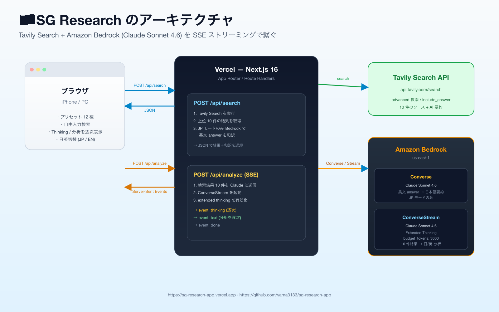

> 個人的にはシンガポール出張前の下調べツールとして作ったが、Tavily の検索結果を Bedrock の Claude に渡して **extended thinking** ごと SSE で流す」というネタを試したい人向けの最小サンプルとして読めるようにした。

- **本番**: https://sg-research-app.vercel.app
- **コード (Public)**: https://github.com/yama3133/sg-research-app
- **記事中のスタック**: Next.js 16 (App Router) / Tavily Search API / Amazon Bedrock (Claude Sonnet 4.6) / Vercel



## なぜ作ったか

「シンガポール出張の準備で、いつもの ChatGPT に同じプロンプトを投げ直すのが面倒」だった。それくらいなら、

- プリセットを一発タップ → Web 検索 → 日本語要約 → AI 分析

を専用ページにしてしまった方が早い。ついでに、最近触っている **Bedrock の extended thinking を SSE でストリーミング表示する** UI のサンプルにもなる。これが本記事の主眼。

## 全体像

ユーザー操作の流れは 1 リクエストで 2 段:

1. **`POST /api/search`** — Tavily に検索を投げる。JP モードなら、英文 answer をそのまま Bedrock の `Converse` で日本語に直して返す。
2. **`POST /api/analyze`** — 検索結果 10 件を Claude に渡し、**`ConverseStream` + extended thinking** で「Thinking」と「分析」を Server-Sent Events で逐次返す。クライアントは `ReadableStream` を `getReader()` で読みながら DOM 更新。

> Tavily 単体でも `include_answer: "advanced"` で AI 要約を返してくれる。それをそのまま見せるだけでも実用だが、**自分のクエリ意図に合わせて 10 件のソースを横断分析させる**には別途 LLM を噛ませる方が体験が良い。

## 実装の核 1: Tavily を叩いて日本語化する

```ts
// app/api/search/route.ts
const payload = {
  query,
  search_depth: "advanced",
  include_answer: "advanced",
  max_results: 10,
  topic: "general",
};

const upstream = await fetch("https://api.tavily.com/search", {
  method: "POST",
  headers: {
    "Content-Type": "application/json",
    Authorization: `Bearer ${apiKey}`,
  },
  body: JSON.stringify(payload),
  cache: "no-store",
});
```

返ってきた `answer` (英文) を、JP モードのときだけ Bedrock の `Converse` に流し込む:

```ts
const client = new BedrockRuntimeClient({ region: "us-east-1" });
const res = await client.send(new ConverseCommand({
  modelId: "us.anthropic.claude-sonnet-4-6",
  system: [{ text: "英文サマリーを自然で簡潔な日本語サマリーに変換する..." }],
  messages: [{ role: "user", content: [{ text: `${query}\n\n${englishAnswer}` }] }],
  inferenceConfig: { maxTokens: 1200, temperature: 0.2 },
}));
```

`Converse` は 1 ショット完結。`output.message.content[].text` を結合して `answer_ja` として返却。

**コツ**: JP モードで翻訳をかけると Tavily の応答時間が 4〜5 秒 → 10 秒程度に伸びる。EN モードでは翻訳をスキップする(`body.lang !== "en"`)ことで体感速度を維持している。

## 実装の核 2: Extended Thinking を SSE で流す

ここが今回いちばんやりたかったところ。`ConverseStreamCommand` に `additionalModelRequestFields` で `thinking` を有効化する:

```ts
const command = new ConverseStreamCommand({
  modelId: "us.anthropic.claude-sonnet-4-6",
  system: [{ text: "...シンガポール出張準備の調査アシスタント..." }],
  messages: [{ role: "user", content: [{ text: userPrompt }] }],
  inferenceConfig: { maxTokens: 6000, temperature: 1 },
  additionalModelRequestFields: {
    thinking: { type: "enabled", budget_tokens: 3000 },
  },
});

const response = await client.send(command);
```

レスポンスストリームは `for await` で回し、ブロックの種類で振り分ける:

```ts
for await (const event of response.stream) {
  if (event.contentBlockDelta?.delta) {
    const delta = event.contentBlockDelta.delta;
    if ("reasoningContent" in delta && delta.reasoningContent?.text) {
      send("thinking", { text: delta.reasoningContent.text });  // ← Thinking
    } else if ("text" in delta && delta.text) {
      send("text", { text: delta.text });                        // ← 本文
    }
  }
}
```

`reasoningContent.text` が **Claude が考えている過程**、`text` が **ユーザーに見せる最終回答**。両方をそれぞれ別の SSE イベント名で流す。

クライアント側は普通の SSE 解釈:

```ts
const reader = res.body.getReader();
const decoder = new TextDecoder();
let buffer = "";
while (true) {
  const { value, done } = await reader.read();
  if (done) break;
  buffer += decoder.decode(value, { stream: true });
  const events = buffer.split("\n\n");
  buffer = events.pop() ?? "";
  for (const ev of events) {
    // event:thinking / event:text を振り分け、payload.text を state に追記
  }
}
```

これだけで「💭 Thinking」と「📝 分析」が別ブロックで、それぞれリアルタイムにダラダラと埋まっていく UI ができる。

## 実装の核 3: Next.js 16 で SSE を返す

Next.js 16 の Route Handler は Web 標準の `Request` / `Response` がそのまま使えるので、`ReadableStream` を返すだけで SSE になる:

```ts
const encoder = new TextEncoder();
const stream = new ReadableStream({
  async start(controller) {
    const send = (event: string, data: unknown) =>
      controller.enqueue(encoder.encode(`event: ${event}\ndata: ${JSON.stringify(data)}\n\n`));
    // … Bedrock のストリームを回しながら send() を呼ぶ
    controller.close();
  },
});

return new Response(stream, {
  headers: {
    "Content-Type": "text/event-stream; charset=utf-8",
    "Cache-Control": "no-cache, no-transform",
    Connection: "keep-alive",
    "X-Accel-Buffering": "no", // バッファリング回避
  },
});
```

> `X-Accel-Buffering: no` は Nginx 系プロキシでよく刺さるやつ。Vercel では実害は出ていないが、念のため。

## ハマったポイント

### 1. プリセットカードの「Marina / Chinatown / Orchard / Bugis 比較」が枠外にハミ出た
スラッシュ区切りの長文字列は、デフォルトの `break-words` だけでは切ってくれない。`[overflow-wrap:anywhere]` を Tailwind の任意値で追加して解決。

```html
<p class="break-words [overflow-wrap:anywhere]">...</p>
```

### 2. iPhone でズームされる/レイアウトが崩れる
`metadata` ではなく **`viewport` export** で書くのが Next.js 16 流。

```ts
export const viewport: Viewport = {
  width: "device-width",
  initialScale: 1,
  viewportFit: "cover",
};
```

### 3. 左下の Next.js Dev インジケータを消したい
Next.js 16 では `devIndicators: false` で全消し。

```ts
const nextConfig: NextConfig = {
  devIndicators: false,
};
```

### 4. Vercel に Bedrock 用の IAM ユーザーを別途作りたくない
複数プロジェクトを Vercel に並べていると、`AmazonBedrockFullAccess` が付いた IAM ユーザーを使い回したくなる。既存ユーザーに**2 個目のアクセスキー**を発行すれば、既存プロジェクトの稼働中キーを止めずに済む。

```bash
aws iam create-access-key --user-name <existing-vercel-user>
```

## 性能感

| モード | Tavily | 分析 (Bedrock Stream) |
|---|---|---|
| JP | 約 10 秒 (含・和訳) | 約 25 秒 (thinking 含む) |
| EN | 約 4〜5 秒 | 約 18 秒 |

JP モードは「英文 answer の和訳」が 5 秒前後足される。気にならない範囲なので、デフォルトを JP のままにしている。

## まとめ

- **Tavily + Bedrock** は思った以上に組み合わせが良い。Tavily で文脈ある検索結果を取って、Bedrock で extended thinking ごと噛み砕く、というパターンは色々なドメインに転用できる。
- **SSE はやはり強い**。`ReadableStream` を `Response` に渡すだけで動く Next.js 16 と相性が良く、思考過程を見せるだけで体感品質が一段上がる。
- 個人ツールとしての出来も意外と良くて、出張前のメモ作りに普通に役立っている。

ソースは GitHub に置いてあるのでよかったら覗いてみてください。

- 🌐 本番: https://sg-research-app.vercel.app
- 💻 GitHub: https://github.com/yama3133/sg-research-app
